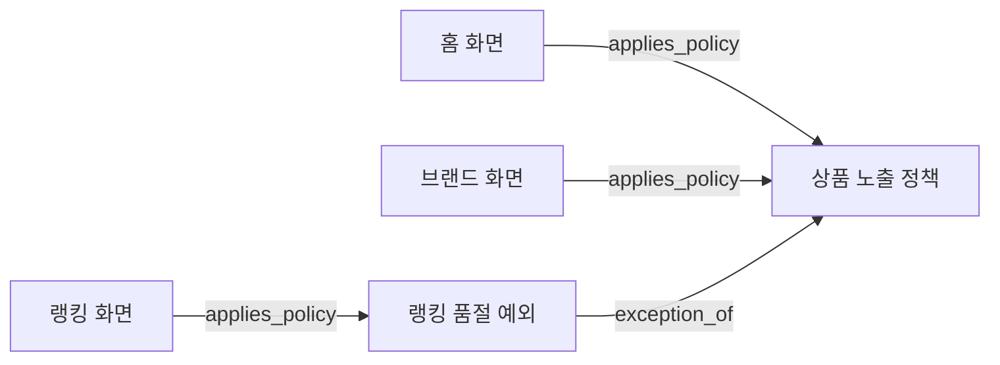

# LLM Wiki

`main`에 병합된 코드를 근거로 서비스의 동작과 정책을 Markdown 문서에 쌓아 가는 도구입니다. 코드가 바뀔 때 관련 문서를 찾아 갱신하고, 다음 작업에서는 정리된 문서와 코드 근거를 함께 확인하는 흐름을 만듭니다.

오래 운영한 서비스에서는 코드, 설계 문서, PR에 설명이 흩어져 있습니다. 같은 정책을 여러 화면에서 쓰거나 호출 위치마다 조건이 달라지면, 변경 파일만 읽고 전체 동작을 파악하기 어렵습니다. LLM Wiki는 이런 지식을 **문서가 답하는 질문과 그 답이 적용되는 범위**로 정리합니다.

현재 문서 분류·근거 검증·PR 게시 엔진을 구현했습니다. 로컬 검사와 기본 CI는 API 키 없이 실행할 수 있습니다. API 키 없는 실제 LLM 실행기 연결과 일별 정기 실행은 다음 구현 단계입니다.

## 문서를 나누는 기준

문서 한 개는 독립적인 질문 하나와 적용 범위를 책임집니다. 변경 파일이나 메서드는 그 답을 확인하는 근거로 사용합니다.

전시 서비스라면 다음처럼 나눌 수 있습니다.

| 유형 | 문서가 답하는 질문 | 담는 내용 |
| --- | --- | --- |
| 화면 `screen` | 홈 화면은 어떤 모듈과 정책으로 구성되는가? | 모듈 선택·조합, 적용 정책 |
| 모듈 `module` | 상품 카드는 어떤 입력을 받아 무엇을 반환하는가? | 입력·출력, 사용하는 화면 |
| 정책 `policy` | 품절 상품은 어떤 조건에서 노출되는가? | 조건·결과·처리 순서, 적용 범위 |
| 기술 동작 `mechanism` | 조회 실패 시 캐시와 fallback은 어떻게 동작하는가? | 캐시·timeout·재시도 등의 동작 |

공통 정책은 한 문서에 두고 적용 화면이 참조합니다. 화면마다 파라미터만 다르면 같은 정책 안에 조건별 차이를 적습니다. 별도 질문으로 설명해야 하는 예외는 독립 문서로 만들고 `exception_of` 관계로 연결합니다.

예를 들어 홈과 브랜드 화면이 품절 제외 정책을 따르고, 랭킹에는 별도 예외가 있다면 다음처럼 연결할 수 있습니다.



이 예제는 구조를 설명하기 위한 가정입니다. 실제 회사의 정책이나 운영 Wiki를 옮긴 내용은 아닙니다.

같은 helper를 호출한다는 이유만으로 공통 정책이라고 판단하지 않습니다. 입력값, 호출 전후 필터, 정렬, 서비스·클라이언트별 분기를 확인해야 합니다. 외부 설정이나 호출 경로를 확인하지 못했다면 그 범위를 미확인으로 남깁니다.

기존 문서를 갱신할지 새 문서를 만들지는 다음을 함께 보고 결정합니다.

1. 기존 문서와 같은 질문에 답하는가?
2. 서비스·화면·클라이언트·조건의 적용 범위가 같은가?
3. 기존 내용과 함께 바뀌는가, 별도로 바뀌는 지식인가?

새 문서를 만들 때는 기존 후보에 담을 수 없는 이유를 설명합니다. 문서를 합치거나 범위를 넓히는 변경은 구조 변경 제안으로 남겨 검토받습니다.

자세한 경계와 문서 예시는 [분류 설계](docs/superpowers/specs/2026-10-04-llm-wiki-topic-structure.md)와 [홈·랭킹 예제](docs/superpowers/specs/2026-10-04-llm-wiki-display-example.md)에 있습니다.

## 코드 변경을 문서에 반영하는 흐름

문서 생성 실행기를 연결하면 다음 순서로 처리합니다.

```text
main에 코드 병합
  → 마지막으로 처리한 커밋 이후의 변경 범위 확정
  → 관련 Wiki·코드·테스트·설계 문서 확인
  → 기존 문서 갱신 또는 새 Topic 제안
  → 문서 패치와 분류 설명 검증
  → Wiki 변경 PR 생성 또는 갱신
```

처리할 코드 범위의 마지막 커밋을 먼저 고정합니다. 중간 커밋에서 바뀌었다가 되돌아온 내용은 변경 맥락으로 읽고, 현재 동작은 최종 코드에 맞춰 설명합니다. 실행 도중 `main`이 앞서더라도 검증 기준을 바꾸지 않습니다.

문서 PR이 아직 병합되지 않았다면 `wiki/pending` 브랜치의 문서를 다음 실행의 시작점으로 사용합니다. 새 제안은 같은 PR에 누적됩니다. 문서 변경이 없는 실행도 마지막으로 처리한 코드 커밋을 기록해 같은 범위를 다시 읽지 않도록 합니다. 이 기록을 **처리 cursor**라고 부릅니다.

설치 이전의 이력을 자동으로 모두 읽지는 않습니다. 첫 실행은 `main` push의 `before..after` 범위부터 시작합니다. 이후에는 기록된 cursor가 유효할 때 그 지점부터 이어 갑니다. 비교할 이전 커밋이 없는 브랜치 생성 이벤트는 초기 설정 안내와 함께 종료합니다.

### 생성과 게시의 역할

[`wiki-ingest.yml`](.github/workflows/wiki-ingest.yml)은 문서 생성과 GitHub 게시를 두 job으로 나눕니다.

| job | 하는 일 | GitHub 권한 |
| --- | --- | --- |
| `ingest` | 코드 변경과 기존 Wiki를 준비하고, LLM 결과를 별도 작업 사본에서 검증 | 저장소 읽기 |
| `publish-pr` | 전달받은 패치와 분류 설명을 다시 검증한 뒤 관리 브랜치·PR 갱신 | 브랜치·PR 쓰기 |

두 job 사이에는 문서 패치, 검증 정보, 프로필 사용 시 분류 설명을 artifact로 전달합니다. LLM에는 GitHub 쓰기 권한을 주지 않으며 게시 job에서는 LLM을 실행하지 않습니다.

현재 Workflow에는 Anthropic API 키를 사용하는 Claude CLI 연결 예시가 남아 있습니다. `LLM_WIKI_ENABLED=true`를 설정해야 실행되며, API 키 없는 실행기로 교체하는 작업은 후속 단계입니다.

### PR에서 확인할 내용

도메인 프로필을 사용하는 실행에서는 문서 변경과 함께 다음 설명을 제출합니다.

- 문서가 답하는 질문과 적용 범위
- 검토한 기존 문서와 선택 이유
- 확인한 코드 경로·심볼·커밋
- 관련 문서를 수정하거나 그대로 둔 이유
- 문서에 반영하지 않은 코드 변경과 그 이유
- 확인하지 못한 동작이나 운영 설정

공통 정책이나 모듈을 바꾸면 이를 참조하는 문서도 확인해야 합니다. 변경 후 관계뿐 아니라 변경 전 관계도 검사하므로, 의존 관계를 지웠다고 영향 설명을 생략할 수는 없습니다. `related_to`는 탐색용 관계로 취급합니다.

## 코드와 설계 문서의 역할

현재 구현을 설명하는 기준은 `main`에 병합된 코드입니다. 테스트는 동작을 확인하는 근거로, Spec·LLD는 승인된 의도를 확인하는 자료로 읽습니다.

코드와 기존 Wiki가 다르면 코드 근거를 들어 Wiki 갱신을 제안합니다. 코드와 Spec·LLD가 다르면 차이를 `Drift`에 기록합니다. 생성 과정에서 사람이 작성한 설계 문서를 수정하지 않습니다.

`docs/specs/`가 없어도 코드와 테스트를 근거로 문서를 만들 수 있습니다. 승인된 의도와의 비교는 확인하지 못한 항목으로 남깁니다. 테스트를 근거로 인용하는 것과 실제로 실행해 통과를 확인하는 것도 구분해 기록합니다.

## 저장소 구성

| 위치 | 역할 |
| --- | --- |
| `CLAUDE.md` | 문서 작성 규칙, 근거와 소유권, 코드·설계 차이의 기록 방식 |
| `.llm-wiki/prompts/ingest.md` | 한 번의 코드 변경을 처리하는 순서 |
| `.llm-wiki/domain.json` | 사람이 선언한 문서 유형·적용 범위·관계 규칙. 사용자가 선택해 추가 |
| `.llm-wiki/profiles/display.example.json` | 전시 서비스용 합성 프로필 예제 |
| `.github/workflows/wiki-ingest.yml` | 실행 조건, job 권한, artifact 전달 |
| `scripts/wiki/` | 입력 준비, 문서·근거 검증, 패치 생성, PR 게시 |
| `docs/specs/` | 사람이 작성한 Spec·LLD·인수 기준. 대상 저장소에 있을 때 참조 |
| `docs/wiki/index.md` | Topic 링크와 한 줄 요약 |
| `docs/wiki/log.md` | 처리한 코드 커밋, 변경 문서, Drift를 추가로 기록하는 이력 |
| `docs/wiki/topics/` | 현재 동작을 설명하는 Topic 문서 |

`docs/wiki/`는 대상 저장소에서 문서를 생성하며 쌓이는 경로입니다. 이 도구 저장소에는 완성된 서비스 Wiki가 포함되어 있지 않습니다.

Topic은 다음처럼 작게 시작할 수 있습니다.

```text
docs/wiki/topics/search-service.md
```

별도로 읽고 참조할 내용이 생기면 기존 문서를 요약과 링크를 담는 진입점으로 두고 세부 문서를 추가합니다.

```text
docs/wiki/topics/
├── search-service.md
└── search-service/
    ├── request-mapping.md
    ├── timeout-and-retry.md
    └── fallback.md
```

기존 Topic ID와 경로는 유지합니다. 기능이 없어지면 문서를 삭제하는 대신 `retired`로 표시해 과거 링크와 근거를 남깁니다. 모든 Topic은 `index.md`에서 직접 또는 다른 Topic을 거쳐 찾을 수 있어야 합니다. `log.md`의 기존 기록은 수정하지 않고 새 기록을 뒤에 추가합니다.

## 대상 저장소에 추가하기

이 도구는 대상 저장소 안에 파일을 함께 두는 방식입니다. 다음 경로를 복사합니다.

```text
CLAUDE.md
.github/workflows/wiki-ingest.yml
.llm-wiki/prompts/ingest.md
.llm-wiki/profiles/display.example.json
scripts/wiki/           # Python·Bash 파일
```

기존 `CLAUDE.md`가 있으면 문서 작성 규칙을 기존 지침에 합칩니다. 엔진에는 Python 3.12 이상, Git, Bash가 필요합니다. 전체 검증의 기준 환경은 Ubuntu 24.04입니다.

도구 자체의 CI도 대상 저장소에 가져가려면 `.github/workflows/ci.yml`과 `tests/`를 함께 복사하고 기존 CI에 맞춰 조정합니다. 이 Workflow는 해당 테스트와 shellcheck·actionlint를 실행합니다.

### 도메인 프로필 설정

문서 유형과 서비스·화면 ID는 `.llm-wiki/domain.json`에 선언합니다. 전시 예제를 사용할 경우 다음처럼 추가합니다.

```bash
mkdir -p .llm-wiki
cp .llm-wiki/profiles/display.example.json .llm-wiki/domain.json
# 예제의 서비스·화면 ID를 대상 저장소에 맞게 수정
git add .llm-wiki/domain.json
git commit -m "docs: declare wiki domain boundaries"
```

예제의 Demo Shop은 가상의 서비스입니다. 프로필은 Git에 기록해야 하며, 검증 엔진은 처리 대상 코드 커밋에 저장된 값을 읽습니다.

프로필이 없으면 기존의 일반 Topic 형식을 사용합니다. 프로필을 추가한 뒤에도 관련 없는 기존 문서는 유지하고, 수정할 문서부터 새 형식으로 전환합니다. 기존 코드 근거와 파일 이동 전 경로도 문서 검색 후보에 포함합니다. 후보 목록이 한도 때문에 잘렸다면 추가 탐색이 필요한지 확인해야 합니다.

### Topic 형식

프로필을 사용하는 Topic에는 본문의 `Scope`, `Current behavior`, `Drift`, `Sources`, `Related topics`에 더해 `Topic metadata`와 `Verification`을 작성합니다.

| 항목 | 작성 규칙 |
| --- | --- |
| `Topic metadata` | JSON 블록 하나에 `schema_version`, `id`, `type`, `question`, `scope`, `lifecycle`, `relations` 기록 |
| `scope` | 서비스·화면 등 각 차원의 값은 선언된 ID 배열 또는 미확인을 뜻하는 `null`. 빈 배열은 허용하지 않음 |
| `relations` | `applies_policy`, `uses_module`, `exception_of`, `depends_on`, `related_to`. 본문에도 대상 문서 링크 필요 |
| `Verification` | 확인한 코드 조건, 관련 테스트와 실행 여부, 미확인 설정·범위 |

`exception_of` 관계가 순환하면 검증에 실패합니다. 이 관계는 정책 사이의 예외를 설명하는 링크이며, 코드를 실행하거나 정책을 자동 상속하는 기능은 아닙니다.

`Sources`에는 코드 경로와 처리 대상 커밋을 적고, 다음 줄에 확인한 심볼과 동작을 설명합니다.

```markdown
- `<repository-relative-path>` at `<40-character-source-commit>`
  <확인한 심볼과 이 코드가 보여 주는 동작>
```

필드와 생성 결과의 전체 형식은 [문서 작성 규칙](CLAUDE.md#domain-classification-only-when-context-has-domain_profile)을 참고합니다.

## 검증과 실패 처리

LLM이 문서를 수정한 작업 사본과 검증에 쓰는 작업 사본을 분리합니다. 검증 엔진은 허용된 파일 경로, 링크, 코드 근거, Topic 유형·범위·관계, 기록 보존, 변경 크기를 검사합니다. 코드·설정·검증 스크립트는 LLM의 편집 대상에서 제외합니다.

프로필을 사용하는 실행은 Wiki 밖의 모든 변경 경로를 `covered_changes` 또는 사유를 적은 `ignored_changes`로 설명해야 합니다. 문서 패치가 비어 있어도 `coverage=complete`인 분류 설명이 필요합니다. 이 값은 입력 변경을 검토했다는 뜻이며, 문서 내용의 의미 정확도를 보장하지는 않습니다.

게시 단계에서는 패치·분류 설명의 checksum, 코드의 비교 범위, 생성에 사용한 Wiki 시작점이 일치하는지 다시 확인합니다. 프로필 사용 시 artifact v2에 이 정보를 묶고, 프로필이 없는 저장소는 기존 v1 형식을 유지합니다. 검증 스크립트는 신뢰하는 저장소의 파일을 사용하고, 프로필은 처리 대상 코드 커밋에서 읽습니다.

기본 한도는 코드 변경 200개 파일·입력 diff 1 MB, Wiki 변경 30개 파일·패치 500 KB입니다. 기존 Claude 연결 예시는 최대 8 turns로 제한합니다. 외부 GitHub Actions는 커밋 SHA로, Claude CLI는 버전으로 고정합니다.

검증 실패, 입력 검토 누락, checksum·비교 범위·Wiki 시작점 불일치가 있으면 게시와 cursor 갱신을 중단합니다. 원인을 해결한 뒤 기존 cursor부터 다시 실행합니다. 미병합 Wiki와 `main`이 충돌하면 먼저 충돌을 해소해야 합니다. 엔진의 관리 표시가 없는 브랜치나 PR은 덮어쓰지 않습니다.

Wiki만 바뀐 입력은 LLM 호출을 건너뜁니다. 문서 변경이 없는 정상 실행에서는 cursor만 갱신하고 빈 PR을 만들지 않습니다. 문서 PR의 병합은 사람이 결정합니다.

### 로컬 검사

임시 Git 저장소와 가짜 LLM·GitHub CLI 응답으로 흐름을 검사합니다. 실제 LLM API를 호출하거나 원격 PR을 만들지 않습니다.

```bash
python3 -m unittest discover -s tests -v
python3 -m compileall -q scripts tests
shellcheck scripts/wiki/*.sh
actionlint
git diff --check
```

분류 결과와 문서 패치를 직접 검사할 때는 다음 명령을 사용합니다. `SOURCE_BASE`, `SOURCE_HEAD`, `WIKI_SEED`에는 입력 준비 단계에서 확정한 Git ref를 넣습니다. `WIKI_SEED`는 문서 수정 전 Wiki의 기준이며 코드의 비교 시작점과 다를 수 있습니다.

```bash
python3 scripts/wiki/classification_report.py --repo . \
  --source-base-ref "$SOURCE_BASE" --source-key "github:$SOURCE_HEAD" \
  --wiki-base-ref "$WIKI_SEED" --compiler-result /tmp/compiler-result.json \
  --output /tmp/classification.json
python3 scripts/wiki/validate_changes.py --repo . --base-ref "$WIKI_SEED" \
  --source-key "github:$SOURCE_HEAD" --source-base-ref "$SOURCE_BASE" \
  --classification-report /tmp/classification.json
```

검사 대상은 Git 근거와 문서 구조, 입력 변경의 처리 설명입니다. 정책의 동일성, 심볼의 실제 의미, 운영 설정까지 자동으로 입증하지는 않습니다. [12개 합성 사례와 평가 기준](tests/fixtures/wiki_classification/acceptance.md)은 준비했으며, 실제 LLM 생성 결과의 의미 평가는 아직 수행하지 않았습니다.

## 참고

원본 자료에서 확인한 지식을 문서에 반영하고 목차·갱신 이력을 유지하는 방식은 Andrej Karpathy의 [LLM Wiki 패턴](https://gist.github.com/karpathy/442a6bf555914893e9891c11519de94f)을 참고했습니다. 이 저장소는 그 방식을 소프트웨어의 코드 변경과 문서 PR 검토에 적용합니다.
