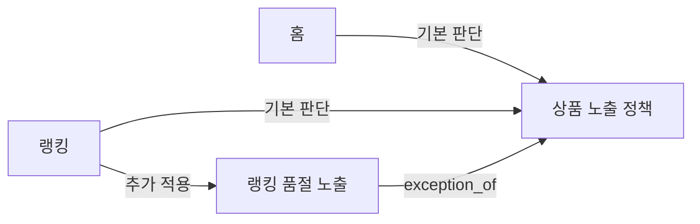

# 전시 LLM Wiki: 문서와 변경 배치 예제

상태: 합성 설계 예제. 실제 29CM·무신사 정책, 실제 코드 검증 결과, 생성된 운영 Wiki가 아님. 코드 경로·심볼은 예제를 설명하기 위한 가정이며 `<head_sha>`는 실제 실행에서 확정할 값.

## 가정한 현재 동작

Demo Shop에는 홈·랭킹 화면이 있다. 기본 노출 판단은 숨김 또는 품절 상품을 제외한다. 랭킹은 품절 후 7일 이내의 상품을 보여주는 별도 규칙이 있다. 숨김 상품은 이 예외로도 표시하지 않는다. 이 규칙의 이유는 코드만으로 확인하지 못했다고 가정한다.



```text
docs/wiki/
  index.md
  log.md
  topics/
    screens/home.md
    screens/ranking.md
    policies/product-visibility.md
    policies/ranking-sold-out.md
```

이 예외는 별도 기간 판정과 테스트가 있고 독립적으로 변경된다고 가정해 별도 정책으로 분리했다. 단순히 같은 함수의 파라미터만 다르다면 대표 정책의 조건표에 담는다. 같은 상품 판단이라도 화면 조립과 최종 조건 결합의 근거를 함께 읽는다.

## 1. 대표 정책 문서

문서: `docs/wiki/topics/policies/product-visibility.md`

````markdown
# 상품 노출 정책

기본 전시 후보에서 제외할 상품과 화면별 예외의 경계를 설명.

## Topic metadata

```json
{
  "schema_version": 1,
  "id": "display.policy.product-visibility",
  "type": "policy",
  "question": "어떤 상품을 기본 전시 후보에서 제외하는가?",
  "scope": {"services": ["demo-shop"], "surfaces": ["home", "ranking"]},
  "lifecycle": "active",
  "relations": []
}
```

## Scope

Demo Shop 홈·랭킹에서 사용하는 기본 후보 판단. 정렬·가격 계산·카드 표현은 범위 밖. 랭킹의 품절 예외는 별도 정책에서 정의.

## Current behavior

| 조건 | 기본 판단 | 예외 여부 | 근거 |
| --- | --- | --- | --- |
| 숨김 상품 | 제외 | 랭킹에서도 유지 | `VisibilityPolicy.hardExcluded`, `RankingSoldOutPolicy.canShow` |
| 품절 상품 | 제외 | 랭킹의 별도 품절 조건 적용 가능 | `VisibilityPolicy.eligible`, 랭킹 품절 정책 |
| 위 조건에 해당하지 않음 | 기본 후보에 포함 | 이후 화면 정렬·필터는 별도 판단 | `VisibilityPolicy.eligible` |

기본 후보 포함은 최종 화면 표시를 보장하지 않음. 홈·랭킹의 호출 전후 흐름은 각 화면 문서에서 설명.

## Verification

예제에서는 홈·랭킹의 호출 경로와 숨김·품절 분기를 확인했다고 가정. 정책의 사업상 이유와 실제 운영 플래그 값은 미확인. 테스트 실행 결과는 이 설계 예제에 포함하지 않음.

## Drift

승인된 Spec을 제공하지 않아 의도와의 차이를 비교하지 못함.

## Sources

- `demo/src/VisibilityPolicy.java` at `<head_sha>`
  - `hardExcluded`와 `eligible`의 기본 제외 조건.
- `demo/src/HomeAssembler.java` at `<head_sha>`
  - 기본 판단을 사용하는 홈의 후보 선택 경로.
- `demo/src/RankingAssembler.java` at `<head_sha>`
  - 기본 판단과 랭킹 품절 정책을 결합하는 호출 경로.
- `demo/src/RankingSoldOutPolicy.java` at `<head_sha>`
  - 기본 숨김 제외를 예외에서도 유지하는 호출·분기.
- `demo/tests/VisibilityPolicyTest.java` at `<head_sha>`
  - 숨김·품절·기본 포함 조건의 기대 결과. 실행 통과의 증거는 아님.

## Related topics

- [랭킹 품절 노출](ranking-sold-out.md): 기본 품절 제외에 대한 예외.
````

## 2. 홈 화면 문서

문서: `docs/wiki/topics/screens/home.md`

````markdown
# 홈 화면

홈의 전시 후보 선택과 적용 정책을 설명.

## Topic metadata

```json
{
  "schema_version": 1,
  "id": "display.screen.home",
  "type": "screen",
  "question": "홈은 어떤 정책으로 상품 후보를 선택하는가?",
  "scope": {"services": ["demo-shop"], "surfaces": ["home"]},
  "lifecycle": "active",
  "relations": [
    {"type": "applies_policy", "target": "display.policy.product-visibility"}
  ]
}
```

## Scope

상품 후보 선택 경로. 홈 전체의 모듈 구성·순서·정렬은 아직 문서화하지 않음.

## Current behavior

후보 선택에 [상품 노출 정책](../policies/product-visibility.md)을 적용. 상세 조건은 정책 문서에서 관리. `HomeAssembler`에는 랭킹의 품절 예외를 결합하는 경로가 없음.

## Verification

예제의 HomeAssembler 후보 선택 경로에 한정. 다른 홈 진입점과 외부 설정은 미확인.

## Drift

승인된 Spec을 제공하지 않아 비교하지 못함.

## Sources

- `demo/src/HomeAssembler.java` at `<head_sha>`
  - 후보 판단의 정책 호출과 이 경로에서의 예외 미사용.

## Related topics

- [상품 노출 정책](../policies/product-visibility.md).
````

## 3. 랭킹 화면 문서

문서: `docs/wiki/topics/screens/ranking.md`

````markdown
# 랭킹 화면

랭킹의 기본 후보 판단과 품절 예외 결합을 설명.

## Topic metadata

```json
{
  "schema_version": 1,
  "id": "display.screen.ranking",
  "type": "screen",
  "question": "랭킹은 기본 후보 판단과 품절 예외를 어떻게 결합하는가?",
  "scope": {"services": ["demo-shop"], "surfaces": ["ranking"]},
  "lifecycle": "active",
  "relations": [
    {"type": "applies_policy", "target": "display.policy.product-visibility"},
    {"type": "applies_policy", "target": "display.policy.ranking-sold-out"}
  ]
}
```

## Scope

랭킹 상품의 후보 선택. 순위 산정과 갱신 주기는 별도 질문이며 아직 문서화하지 않음.

## Current behavior

[상품 노출 정책](../policies/product-visibility.md)의 기본 후보 판단에 [랭킹 품절 노출](../policies/ranking-sold-out.md)을 결합. 숨김 제외를 먼저 유지한 뒤 품절 예외를 판정. 기간의 값과 경계는 예외 정책이 소유.

## Verification

예제의 RankingAssembler와 RankingSoldOutPolicy 호출 경로를 확인했다고 가정. 클라이언트의 표시 방식과 운영 설정은 미확인.

## Drift

승인된 Spec을 제공하지 않아 비교하지 못함.

## Sources

- `demo/src/RankingAssembler.java` at `<head_sha>`
  - 기본 판단과 품절 예외를 결합하는 후보 선택.
- `demo/src/RankingSoldOutPolicy.java` at `<head_sha>`
  - 숨김 제외와 품절 예외의 처리 순서.

## Related topics

- [상품 노출 정책](../policies/product-visibility.md).
- [랭킹 품절 노출](../policies/ranking-sold-out.md).
````

## 4. 독립 예외 문서

문서: `docs/wiki/topics/policies/ranking-sold-out.md`

````markdown
# 랭킹 품절 노출

랭킹에서 품절 상품이 후보에 남을 수 있는 조건을 설명.

## Topic metadata

```json
{
  "schema_version": 1,
  "id": "display.policy.ranking-sold-out",
  "type": "policy",
  "question": "랭킹에서 품절 상품을 언제 후보에 포함하는가?",
  "scope": {"services": ["demo-shop"], "surfaces": ["ranking"]},
  "lifecycle": "active",
  "relations": [
    {"type": "exception_of", "target": "display.policy.product-visibility"}
  ]
}
```

## Scope

랭킹에만 적용. 홈과 다른 서비스의 품절 처리를 설명하지 않음.

## Current behavior

| 조건 | 결과 | 근거 |
| --- | --- | --- |
| 기본 정책의 숨김 제외에 해당 | 제외 유지 | `VisibilityPolicy.hardExcluded` 호출 |
| 숨김이 아니며 품절 시각부터 요청 기준 시각까지 7일 이내 | 품절 예외로 후보 포함 | `RankingSoldOutPolicy.canShow` |
| 기간 초과 또는 필요한 시각 정보 없음 | 품절 예외 적용하지 않음 | 동일 메서드의 기간·누락 분기 |

이 예제는 7일 경계를 포함하고 요청 기준 시각을 사용한다고 가정. 실제 문서에서는 비교 연산·시간 단위·타임존·누락 분기를 읽어 기록해야 함.

## Verification

예제에서는 위 조건과 관련 테스트를 확인했다고 가정. 왜 7일인지에 대한 사업상 근거와 실제 운영 설정은 미확인.

## Drift

승인된 Spec을 제공하지 않아 비교하지 못함.

## Sources

- `demo/src/RankingSoldOutPolicy.java` at `<head_sha>`
  - `canShow`의 숨김 우선 제외, 기간과 시각 누락 분기.
- `demo/tests/RankingSoldOutPolicyTest.java` at `<head_sha>`
  - 숨김·기간 경계·시각 누락의 기대 결과. 실행 통과의 증거는 아님.

## Related topics

- [상품 노출 정책](product-visibility.md): 기본 판단.
````

## 하루의 변경을 어디에 반영하는가

위 네 문서가 기존 Wiki에 있다고 가정. 다음 순서로 코드가 main에 병합됐다.

| 순서 | 코드 변경 |
| --- | --- |
| C1 | `hardExcluded`가 숨김 또는 판매 차단 상품을 제외하도록 변경. 기본 판단과 랭킹 예외 모두 이 메서드를 호출 |
| C2 | 랭킹 품절 기간 7일 → 3일 |
| C3 | 기본 정책 클래스 이름·경로 변경, 동작 유지 |
| C4 | 랭킹 품절 기간 3일 → 7일 원복 |

### 최종 head 기준의 분류 설명

| 대상 | 결정 | 이유·확인 근거 |
| --- | --- | --- |
| 상품 노출 정책 | 갱신 | 판매 차단 제외가 최종 head에 존재. 이동한 코드 경로로 출처 변경 |
| 랭킹 품절 노출 | 갱신 | 판매 차단도 예외보다 먼저 제외됨을 호출 경로에서 확인. 기간은 최종 7일로 유지 |
| 홈 화면 | 검토 후 생략 | 같은 정책을 호출하고 본문에 제외 조건을 복제하지 않아 설명·출처가 변하지 않음 |
| 랭킹 화면 | 문구 갱신 | 기존 “숨김 제외를 먼저 유지”가 판매 차단까지 포함하도록 달라짐 |
| 새로운 정책 Topic | 생성 생략 | 제외 조건 추가와 코드 이동은 기존 질문·범위 안의 변화 |

분류 설명에는 C2의 3일을 최종 동작으로 쓰지 않은 이유, 홈을 수정하지 않은 이유, 새 Topic을 만들지 않은 이유를 함께 남긴다. 변경한 Topic은 정확한 최종 head 출처로 갱신. 수정하지 않은 Topic의 SHA를 전체 Wiki 최신성 표시를 위해 일괄 변경하지 않는다.

중요한 반례: C1에서 기본 정책만 바뀌고 랭킹 예외가 새로운 제외 조건을 확인하지 않는다면, 랭킹에서도 판매 차단이 적용된다고 쓰면 안 된다. 랭킹의 실제 최종 결과와 불일치를 기록하고 검토를 요청한다. 코드가 의도와 같은지는 별도 승인 자료로 확인한다.

## 이 예제가 검증할 질문

1. “홈과 랭킹의 공통 규칙은?” → 대표 정책의 기본 판단, 예외의 적용 범위를 함께 답함
2. “랭킹 품절 상품은 왜 보일 수 있나?” → 예외의 조건과 경계는 답하되 사업상 이유는 미확인으로 답함
3. “기간을 바꾸면 홈도 바뀌나?” → 확인한 홈 경로는 예외를 사용하지 않아 영향 없음. 미확인 경로까지 단정하지 않음
4. “공통 helper를 바꿨으니 모든 화면이 바뀌나?” → 실제 호출과 후처리를 확인한 범위만 답함
5. “이 Wiki는 전시 전체를 설명하나?” → 문서화된 후보 선택 범위와 미문서화된 구성·순위 산정을 구분함

이 파일은 문서 형태와 기대 분류를 보여주는 자료다. 합성 코드 저장소에 대한 엔진 테스트나 실제 LLM 평가를 실행한 결과는 아니다.
